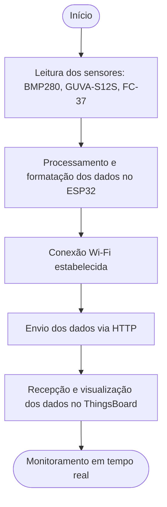
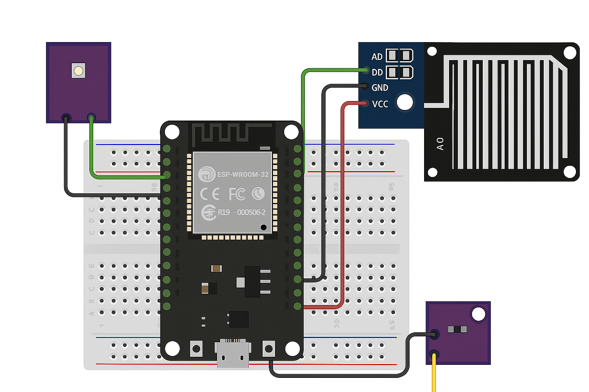

# 🌱 Monitoramento Ambiental em Tempo Real com ESP32

Projeto desenvolvido como parte da disciplina de Integração IoT do curso de Análise e Desenvolvimento de Sistemas, com foco na criação de uma estação meteorológica inteligente utilizando ESP32 e a plataforma IoT ThingsBoard.

<br>

## 📌 Descrição

Este projeto propõe o desenvolvimento de uma estação meteorológica inteligente, que permite:

- Coleta de dados ambientais em tempo real.
- Envio dos dados via Wi-Fi para a nuvem utilizando requisições HTTP.
- Visualização em um painel interativo na plataforma ThingsBoard.

A estação utiliza sensores para medir:

- 🌡️ Temperatura e pressão atmosférica (BMP280)  
- ☀️ Radiação ultravioleta (GUVA-S12S)  
- 🌧️ Detecção de chuva (FC-37)

<br>

## 💡 Objetivos

- Criar uma solução acessível e escalável para o monitoramento climático.
- Promover o uso de tecnologias abertas e de baixo custo.
- Desenvolver um painel para visualização de dados ambientais em tempo real.

<br>

## 🛠️ Tecnologias Utilizadas

- **ESP32** — Microcontrolador com Wi-Fi integrado  
- **Wi-Fi** — Comunicação com a nuvem via protocolo HTTP  
- **ThingsBoard** — Plataforma IoT para visualização de dados  
- **Arduino IDE** — Para desenvolvimento e upload do firmware  
- **Sensores**:
  - BMP280 (Temperatura e Pressão)
  - GUVA-S12S (Índice UV)
  - FC-37 (Sensor de Chuva)

  <br>

## 🧰 Diagrama da Arquitetura




<br>

## ⚙️ Montagem do Hardware

A montagem foi feita em protoboard. Abaixo o esquema de ligação dos sensores ao ESP32:




<br>

## 💻 Software Embarcado

Desenvolvido em C++ com Arduino IDE, o sistema:

1. Lê os dados dos sensores.
2. Formata os dados em JSON.
3. Envia via Wi-Fi ao servidor ThingsBoard utilizando HTTP.

Fluxo do software:

```cpp
#include <Wire.h>
#include <WiFi.h>
#include <HTTPClient.h>
#include <Adafruit_BMP280.h>

// ------------------------------
// Configurações de rede
// ------------------------------
const char* ssid = "Ricardo_S";
const char* password = "12345679";

const char* tb_host = "http://thingsboard.cloud/api/v1/hnace9l65g5qiv2e5s3g/telemetry"; // Endpoint completo
const char* tb_token = "hnace9l65g5qiv2e5s3g";

// ------------------------------
// Configurações Gerais
// ------------------------------
#define SDA_PIN 21
#define SCL_PIN 22

#define UV_SENSOR_PIN 34
#define SENSOR_CHUVA_PIN 13
#define ADC_RESOLUTION 4095.0
#define V_REF 3.3
#define ALTITUDE_SOROCABA 601.0

Adafruit_BMP280 bmp;

void connectWiFi() {
  Serial.print("🔌 Conectando ao Wi-Fi...");
  WiFi.begin(ssid, password);
  while (WiFi.status() != WL_CONNECTED) {
    delay(500);
    Serial.print(".");
  }
  Serial.println("\n✅ Wi-Fi conectado com sucesso!");
  Serial.print("📶 IP: ");
  Serial.println(WiFi.localIP());
}

void setup() {
  Serial.begin(115200);
  delay(1000);

  pinMode(SENSOR_CHUVA_PIN, INPUT);
  analogReadResolution(12);

  Wire.begin(SDA_PIN, SCL_PIN);

  if (!bmp.begin()) {
    Serial.println("❌ BMP280 não encontrado!");
    while (1) delay(1000);
  }

  Serial.println("✅ BMP280 iniciado com sucesso!");

  connectWiFi();
}

void loop() {
  Serial.println("🟢 Lendo sensores...");

  // Leitura média do UV para reduzir ruído
  float soma_uv = 0;
  for (int i = 0; i < 10; i++) {
    soma_uv += analogRead(UV_SENSOR_PIN);
    delay(10);
  }
  float raw_uv = soma_uv / 10.0;
  float voltage_uv = (raw_uv / ADC_RESOLUTION) * V_REF;

  // Correção do cálculo UV (estimativa)
  float uvi = (voltage_uv - 1.0) * 14.5;
  if (uvi < 0) uvi = 0;

  // Leitura do BMP280
  float temperatura = bmp.readTemperature();
  float pressao_abs = bmp.readPressure() / 100.0F;
  float pressao_nivel_mar = pressao_abs / pow(1 - (ALTITUDE_SOROCABA / 44330.0), 5.255);

  // Leitura da chuva
  int estado_chuva = digitalRead(SENSOR_CHUVA_PIN);
  String chuva = estado_chuva == LOW ? "Chuva" : "Seco";

  // Monta JSON
  String payload = "{";
  payload += "\"uvi\":" + String(uvi, 1) + ",";
  payload += "\"tensao_uv\":" + String(voltage_uv, 2) + ",";
  payload += "\"temperatura\":" + String(temperatura, 2) + ",";
  payload += "\"pressao_abs\":" + String(pressao_abs, 2) + ",";
  payload += "\"pressao_nivel_mar\":" + String(pressao_nivel_mar, 2) + ",";
  payload += "\"chuva\":\"" + chuva + "\"";
  payload += "}";

  Serial.println("📤 Enviando para ThingsBoard:");
  Serial.println(payload);

  if (WiFi.status() == WL_CONNECTED) {
    HTTPClient http;
    http.begin(tb_host); // ✅ URL corrigida
    http.addHeader("Content-Type", "application/json");

    int httpResponseCode = http.POST(payload);

    if (httpResponseCode > 0) {
      Serial.print("✅ Enviado! Código: ");
      Serial.println(httpResponseCode);
    } else {
      Serial.print("❌ Erro ao enviar. Código: ");
      Serial.println(httpResponseCode);
    }
    http.end();
  } else {
    Serial.println("⚠️ Wi-Fi desconectado. Tentando reconectar...");
    connectWiFi();
  }

  Serial.println("--------------------------------------");
  delay(5000); // Aguarda 5 segundos
}
```

<br>

## 📊 Dashboard no ThingsBoard

Os dados coletados são visualizados por meio de widgets personalizados:


<br>

## ✅ Resultados Obtidos

- 📶 Baixa latência no envio de dados.  
- 📈 Visualização confiável e em tempo real.  
- 🔧 Sistema modular e expansível.  
- 🌍 Possível aplicação em agricultura, cidades inteligentes e educação.

<br>

## 👨‍💻 Autores / Orientador

**Orientador:**  
- **Profº Cainã Antunes** — [caina497@gmail.com](mailto:caina497@gmail.com)

**Autores:**  
- **Luis Henrique Sampaio** — [luis.sampaio4@senaisp.edu.br](mailto:luis.sampaio4@senaisp.edu.br)  
- **Ricardo Ferreira da Silva** — [ricardo.silva114@senaisp.edu.br](mailto:ricardo.silva114@senaisp.edu.br)  
- **Vinicius Pires de Souza** — [vinicius.souza162@senaisp.edu.br](mailto:vinicius.souza162@senaisp.edu.br)

<br>

## 📄 Artigo Técnico

Este projeto foi documentado em um artigo detalhado, disponível para leitura no formato PDF.

📥 [Clique aqui para acessar o artigo completo](artigo/Monitoramento%20Ambiental%20em%20Tempo%20Real%20com%20ESP32%20Uma%20Abordagem%20via%20IoT.pdf)

<br>

## 📄 Licença

Este projeto é licenciado sob a licença MIT - consulte o arquivo [LICENSE](LICENSE) para mais detalhes.
