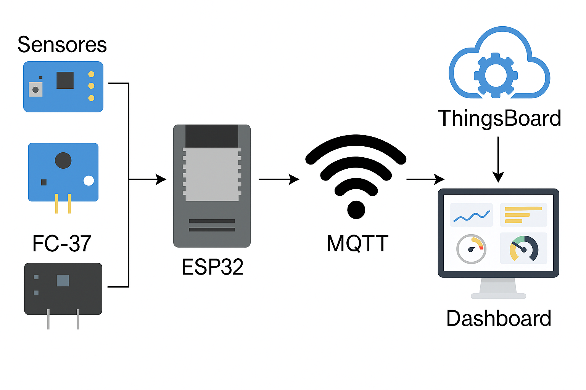
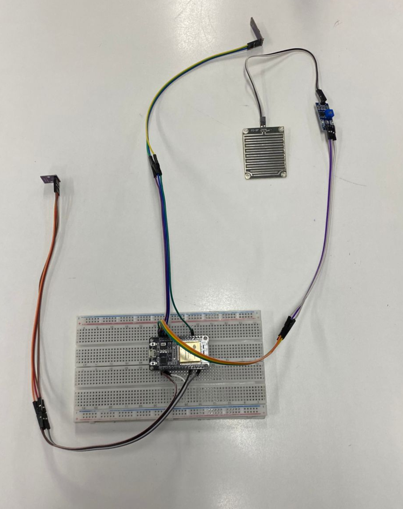
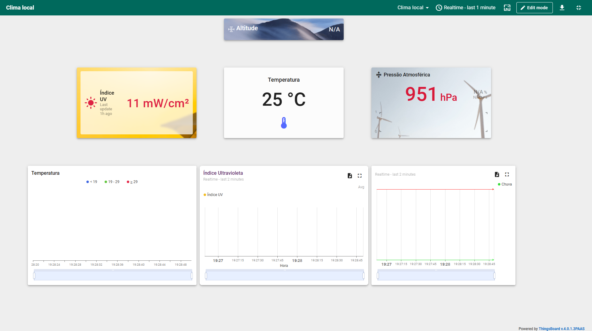

# 🌱 Monitoramento Ambiental em Tempo Real com ESP32

Projeto desenvolvido como parte da disciplina de Integração IoT do curso de Análise e Desenvolvimento de Sistemas, com foco na criação de uma estação meteorológica inteligente utilizando ESP32 e a plataforma IoT ThingsBoard.

## 📌 Descrição

Este projeto propõe o desenvolvimento de uma estação meteorológica inteligente, que permite:

- Coleta de dados ambientais em tempo real.
- Envio dos dados via Wi-Fi para a nuvem utilizando o protocolo MQTT.
- Visualização em um painel interativo na plataforma ThingsBoard.

A estação utiliza sensores para medir:

- 🌡️ Temperatura e pressão atmosférica (BMP280)
- ☀️ Radiação ultravioleta (GUVA-S12S)
- 🌧️ Detecção de chuva (FC-37)

---

## 💡 Objetivos

- Criar uma solução acessível e escalável para o monitoramento climático.
- Promover o uso de tecnologias abertas e de baixo custo.
- Desenvolver um painel para visualização de dados ambientais em tempo real.

---

## 🛠️ Tecnologias Utilizadas

- **ESP32** — Microcontrolador com Wi-Fi integrado
- **MQTT** — Protocolo leve de comunicação M2M
- **ThingsBoard** — Plataforma IoT para visualização de dados
- **Arduino IDE** — Para desenvolvimento e upload do firmware
- **Sensores**:
  - BMP280 (Temperatura e Pressão)
  - GUVA-S12S (Índice UV)
  - FC-37 (Sensor de Chuva)

---

## 🧰 Diagrama da Arquitetura



---

## ⚙️ Montagem do Hardware

A montagem foi feita em protoboard. Abaixo o esquema de ligação dos sensores ao ESP32:



---

## 💻 Software Embarcado

Desenvolvido em C++ com Arduino IDE, o sistema:

1. Lê os dados dos sensores.
2. Formata os dados em JSON.
3. Envia via Wi-Fi ao servidor MQTT.

Fluxo do software:


---

## 📊 Dashboard no ThingsBoard

Os dados coletados são visualizados por meio de widgets personalizados:



---

## ✅ Resultados Obtidos

- 📶 Baixa latência no envio de dados.
- 📈 Visualização confiável e em tempo real.
- 🔧 Sistema modular e expansível.
- 🌍 Possível aplicação em agricultura, cidades inteligentes e educação.

---

## 🚀 Como Executar o Projeto

1. Clone este repositório:
   ```bash
   git clone https://github.com/seu-usuario/seu-repositorio.git
   cd seu-repositorio
   ```

2. Abra o código na Arduino IDE.

3. Instale as bibliotecas necessárias:
   - `Adafruit_BMP280`
   - `WiFi`
   - `PubSubClient`

4. Preencha as credenciais de Wi-Fi e MQTT no código:
   ```cpp
   const char* ssid = "SEU_WIFI";
   const char* password = "SENHA_WIFI";
   const char* mqtt_server = "BROKER_MQTT";
   ```

5. Faça o upload para o ESP32.

6. Acesse o painel do ThingsBoard e configure os widgets de acordo com os dados enviados.

---

## 👨‍💻 Autores / Orientador
**Orientador:** 
 - **Profº Cainã Antunes** — [caina497@gmail.com](mailto:caina497@gmail.com)

 **Autores:**
- **Luis Henrique Sampaio** — [luis.sampaio4@senaisp.edu.br](mailto:luis.sampaio4@senaisp.edu.br)
- **Ricardo Ferreira da Silva** — [ricardo.silva114@senaisp.edu.br](mailto:ricardo.silva114@senaisp.edu.br)
- **Vinicius Pires de Souza** — [vinicius.souza162@senaisp.edu.br](mailto:vinicius.souza162@senaisp.edu.br)

---

## 📄 Licença

Este projeto é licenciado sob a licença MIT - consulte o arquivo [LICENSE](LICENSE) para mais detalhes.

---

